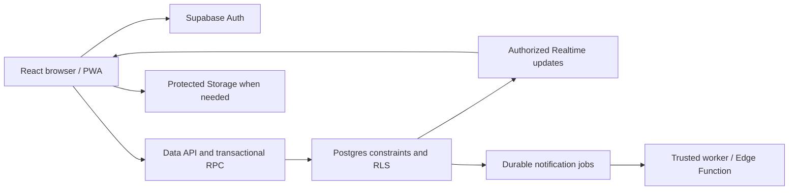

# Architecture plan

Status: required stack established; implementation boundaries proposed against the supplied product brief.

## Baseline

Use Vite, TypeScript, React Compiler, Supabase with multi-tenancy/RLS, and one mobile-first responsive web/PWA application. These explicit user choices override the handoff's tentative stack suggestions.

The existing app is in `the-crowded-table-app/` and has React Compiler configured. This planning revision does not implement backend, PWA, or features.

## System responsibilities

Simple permitted reads and narrow updates use caller-scoped data access. Atomic seat, entitlement, result, and administrative operations use database commands. Edge Functions handle external services, future payment integrations, or delivery workers where required. Several independent database calls from an Edge Function do not form one transaction.

Supabase Realtime is the proposed transport for table chat updates, with durable database messages as the source of truth. Storage supports profile photos if introduced; its access rules must match the profile audience. No general-purpose server or external chat network is needed by default.

## Tenant and identity design

Propose **one independently operated community per tenant**, initially The Crowded Table in Tegucigalpa. A home, café, or rented space is a location within a community, not a tenant. Multi-community accounts may be supported structurally without exposing a tenant switcher in the first single-community UI.

The precise future tenant business model still needs agreement. Do not create a commercial venue-management system or per-table tenants. Domain examples use `tenant_id`; a selected slug/ID is never authority.

Keep four independent concepts:

1. Account identity: who is signed in.
2. Community association and standing: tenant participation, approval, suspension/removal.
3. Membership entitlement: time-bounded access to paid benefits.
4. Resource participation: a particular confirmed seat, chat, or championship entry.

A nonmember may have a community account and buy a drop-in/competition entry. A paid member may be suspended. A staff role does not automatically mean paid benefits.

## Domain boundaries

| Domain | Responsibility |
| --- | --- |
| Official events | Public discovery, member admission, eligible drop-ins, separate special tickets |
| Meet & Play | Member-created tables, requests, confirmation, waiting, and matching requests |
| Membership | Access periods and manual grant/revocation independent of payment provider |
| Participation | Resource-specific eligibility, capacity, seat states, attendance |
| Chat | Confirmed table participants, durable messages, archival |
| Championship | Registrations, versioned rules, match evidence/confirmation, standings, finals |
| Community | Private discussions, directory, moderation |
| Admin | Authorized commands with audit records |
| Notifications | Durable in-app notices and retryable delivery; external channels undecided |

Official events and member tables have distinct roots and authorization. A shared scheduling/seat-control record is proposed to support common capacity and location invariants; see the schema plan. Sharing UI or transaction helpers must not share admission permissions accidentally.

## Data exposure

- Public: published official-event summaries, safe display locations, membership information, and championship overview. Public leaderboard identity details remain open.
- Member-only: member tables, directory, and Community content.
- Confirmed-participant-only: private addresses and table chat, subject to lifecycle rules.
- Self-only: private account preferences, payment/entitlement history, pending requests.
- Staff-restricted: manual grants, disputes, moderation reports, and audit data.

Store exact addresses separately from safe location summaries. Never include private addresses in list/detail payloads, public views, notifications, logs, or Realtime broadcasts. Access to an address needs a dedicated authorized read.

## Money versus access

Prices and entitlement rules are configuration. Manual verification can satisfy a payment requirement initially. Record payment evidence and approval separately from the entitlement or seat it enables. A claimed payment, uploaded proof, or browser success state is not trusted confirmation. Future provider webhooks must feed the same audited commands.

Payment automation is deferred; paid admission and membership workflows are MVP scope. Expiry and refund behavior must be resolved before dependent flows ship.

## Operations and tooling

Use separate local, non-production, and production data/configuration. Version migrations, grants, policies, functions, and generated types. Keep Supabase secret/service credentials in trusted runtimes; only public configuration goes to the browser. [Vite environment guidance](https://vite.dev/guide/env-and-mode) explains client-exposed environment variables.

Router, query library, form validation, styling primitives, PWA tooling, hosting, and delivery channels remain unselected. Keep the existing app folder. Add scheduled work for waitlist expiry and chat archival only with an explicit reliable execution mechanism and retry/monitoring plan.
